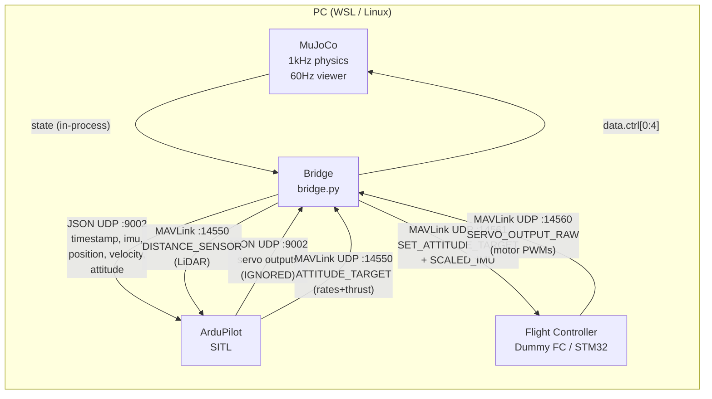
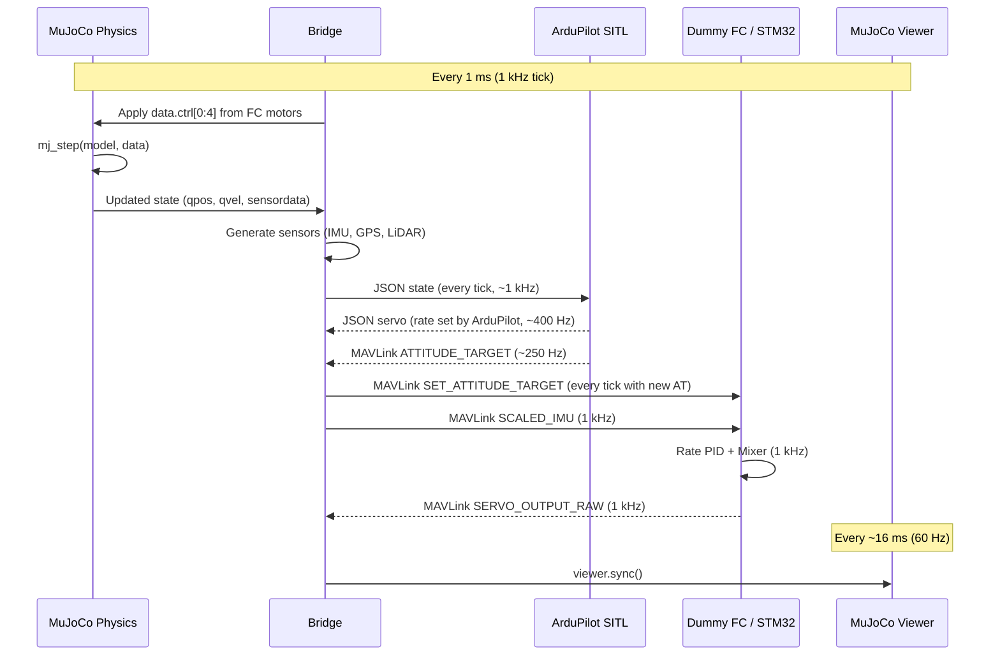

# HIL Multirotor — Architecture & MAVLink Reference

## 1. System Overview

```
┌─────────────────────────── PC (WSL / Linux) ─────────────────────────┐
│                                                                       │
│  ┌──────────────┐   JSON UDP    ┌──────────────────────────────────┐  │
│  │ ArduPilot    │◄────────────► │  MuJoCo Bridge  (bridge.py)     │  │
│  │ SITL         │   :9002       │                                  │  │
│  │              │               │  • MuJoCo physics @ 1 kHz        │  │
│  │  Navigation  │  MAVLink UDP  │  • GUI viewer   @ 60 Hz         │  │
│  │  State Est.  │◄────────────► │  • Sensor generation             │  │
│  │  Outer loops │   :14550      │  • Motor force application       │  │
│  └──────────────┘               │  • MAVLink routing               │  │
│                                  └───────────┬────────────────────┘  │
│                                    MAVLink UDP │ :14560 / :14561      │
│                                  ┌─────────────▼──────────────────┐  │
│                                  │ Flight Controller Endpoint     │  │
│                                  │                                │  │
│                                  │ Stage 2: dummy_fc.py (Python)  │  │
│                                  │ Stage 3: STM32F407 (Serial)    │  │
│                                  │                                │  │
│                                  │ • Rate PID (1 kHz)             │  │
│                                  │ • Quad-X mixer                 │  │
│                                  │ • Failsafe                     │  │
│                                  └────────────────────────────────┘  │
└───────────────────────────────────────────────────────────────────────┘
```

## 2. Data-Flow Diagram (Mermaid)



## 3. Timing Diagram (Mermaid)



## 4. What Runs Where

| Component | Runs on | Rate | Why feasible on STM32F407 |
|-----------|---------|------|---------------------------|
| MuJoCo physics + viewer | PC | 1 kHz / 60 Hz | N/A — PC only |
| Sensor generation | PC (bridge) | 1 kHz / 10 Hz / 30 Hz | N/A — sensors are virtual |
| ArduPilot SITL (EKF, nav, outer loops) | PC | 400 Hz | Too complex for STM32; stays on PC |
| Rate PID controller | Dummy FC → STM32 | 1 kHz | 3 simple PIDs ≈ 5 µs on Cortex-M4F |
| Quad-X mixer | Dummy FC → STM32 | 1 kHz | 4×4 matrix multiply ≈ 1 µs |
| MAVLink parse/encode | Dummy FC → STM32 | 1 kHz | C library, ~50 µs per frame |
| Failsafe logic | Dummy FC → STM32 | 1 kHz | Trivial timestamp comparison |
| **Total FC budget** | | | **< 100 µs of 1000 µs tick** |

## 5. MAVLink Message Mapping

### 5.1 Sensor Messages (Bridge → ArduPilot)

| Message | ID | Rate | Direction | Key Fields | Units / Frame |
|---------|----|------|-----------|------------|---------------|
| *(via JSON)* | — | 1 kHz | Bridge → AP | gyro, accel_body, position, attitude, velocity | NED body / WGS-84 |
| `DISTANCE_SENSOR` | 132 | 10 Hz | Bridge → AP | current_distance, orientation=PITCH_270 | cm, downward |

### 5.2 Setpoint Messages (ArduPilot → Bridge → FC)

| Message | ID | Rate | Direction | Key Fields | Units / Frame |
|---------|----|------|-----------|------------|---------------|
| `ATTITUDE_TARGET` | 83 | 250 Hz | AP → Bridge | body_roll_rate, body_pitch_rate, body_yaw_rate, thrust | rad/s NED-body, 0..1 |
| `SET_ATTITUDE_TARGET` | 82 | 250 Hz | Bridge → FC | body_roll_rate, body_pitch_rate, body_yaw_rate, thrust, type_mask=0x07 | rad/s NED-body, 0..1 |

### 5.3 IMU Feedback (Bridge → FC)

| Message | ID | Rate | Direction | Key Fields | Units |
|---------|----|------|-----------|------------|-------|
| `SCALED_IMU` | 26 | 1 kHz | Bridge → FC | xgyro, ygyro, zgyro | mrad/s (NED body) |
| | | | | xacc, yacc, zacc | milli-g (NED body) |

### 5.4 Motor Output (FC → Bridge)

| Message | ID | Rate | Direction | Key Fields | Units |
|---------|----|------|-----------|------------|-------|
| `SERVO_OUTPUT_RAW` | 36 | 1 kHz | FC → Bridge | servo1_raw .. servo4_raw | PWM 1000–2000 |

### 5.5 Heartbeat & Status

| Message | ID | Rate | Direction | Notes |
|---------|----|------|-----------|-------|
| `HEARTBEAT` | 0 | 1 Hz | Bridge → AP, Bridge → FC, FC → Bridge | MAV_TYPE / MAV_STATE |

### 5.6 Camera Side-Channel

| Transport | Rate | Direction | Content |
|-----------|------|-----------|---------|
| UDP :14570 (raw) | 30 Hz | Bridge → consumer | Raw RGB frame bytes (320×240×3) |
| `CAMERA_IMAGE_CAPTURED` (msg 263) | 30 Hz | Bridge → AP | timestamp, sequence, file_url="" |

Camera raw frames are NOT sent via MAVLink (too large). MAVLink carries
only metadata + timestamps for synchronization.

## 6. System IDs and Endpoints

| Entity | sysid | compid | Endpoint |
|--------|-------|--------|----------|
| ArduPilot SITL | 1 | 1 | JSON: UDP :9002 / MAVLink: UDP :14550 |
| MuJoCo Bridge | 2 | 1 | JSON: binds :9002 / MAVLink: binds :14550, sends to :14561 |
| Flight Controller | 3 | 1 | **Stage 2:** UDP binds :14561, sends to :14560 |
| | | | **Stage 3:** Serial /dev/ttyUSB0 @ 921600 baud |

## 7. Coordinate Frame Transforms

```
MuJoCo World:   X = forward (North)    Y = left (West)     Z = up
NED World:      X = North              Y = East             Z = Down

Transform:  v_ned = diag(1, -1, -1) × v_mujoco

Body frame (same transform):
  p_ned =  ωx_mj        (roll rate)
  q_ned = -ωy_mj        (pitch rate)
  r_ned = -ωz_mj        (yaw rate)

Euler angles (ZYX aerospace sequence):
  roll_ned  = atan2(R_ned[2,1], R_ned[2,2])
  pitch_ned = -asin(R_ned[2,0])
  yaw_ned   = atan2(R_ned[1,0], R_ned[0,0])

where R_ned = T × R_mj × T,  T = diag(1,-1,-1)
```

## 8. Staged Path

### Stage 1 — Bridge + MuJoCo Only
- No ArduPilot, no FC.
- Built-in `SimpleHoverController` drives motors directly.
- Purpose: verify MuJoCo model, motor directions, viewer stability, sensor output.
- Run: `python bridge.py --stage 1`

### Stage 2 — Full Pipeline with Python Dummy FC
- ArduPilot SITL provides navigation / outer loops.
- Bridge routes setpoints + IMU to Dummy FC.
- Dummy FC runs rate PID + mixer, returns motor outputs.
- Full closed-loop visible in MuJoCo GUI.
- Run (3 terminals):
  1. `sim_vehicle.py -v Copter --model JSON -I0`
  2. `python bridge.py --stage 2`
  3. `python dummy_fc.py`

### Stage 3 — STM32 Replaces Dummy FC
- Stop `dummy_fc.py`.
- Flash STM32F407 with C firmware (same message contract).
- Connect STM32 via USB-Serial adapter (/dev/ttyUSB0 @ 921600).
- Run: `python bridge.py --stage 3 --serial /dev/ttyUSB0`
- Everything else unchanged.

## 9. Motor Layout & Mixer

```
       Front (+X, North)
   M3 (CCW)        M1 (CW)
   Blue             Red
       ╲            ╱
         ╲        ╱
           ╲    ╱
            ╲  ╱
             ╳
            ╱  ╲
           ╱    ╲
         ╱        ╲
       ╱            ╲
   M2 (CW)        M4 (CCW)
   Green           Yellow
       Rear (−X, South)

Mixer (Quad-X):
  M1 = Thr - Roll + Pitch - Yaw     (FR, CW)
  M2 = Thr + Roll - Pitch - Yaw     (BL, CW)
  M3 = Thr + Roll + Pitch + Yaw     (FL, CCW)
  M4 = Thr - Roll - Pitch + Yaw     (BR, CCW)
```
